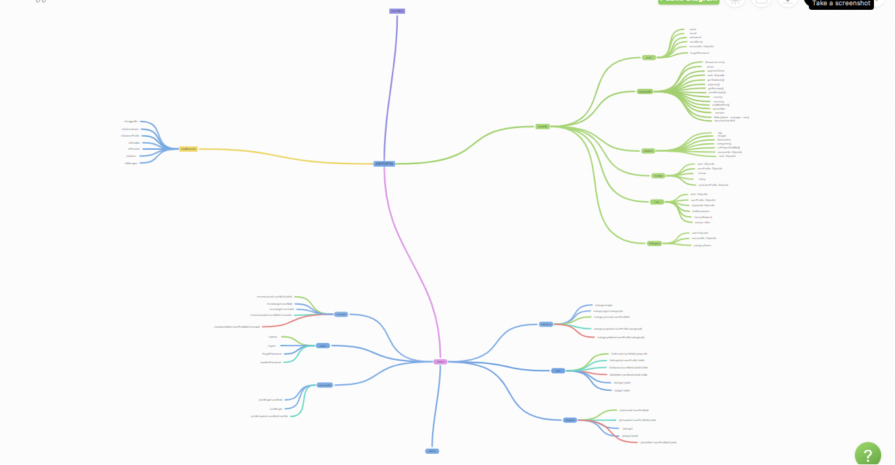
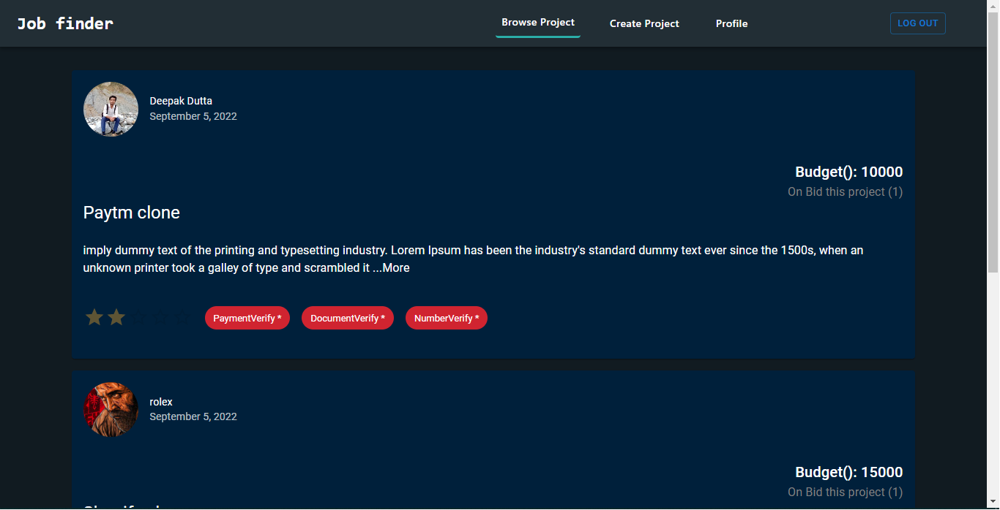
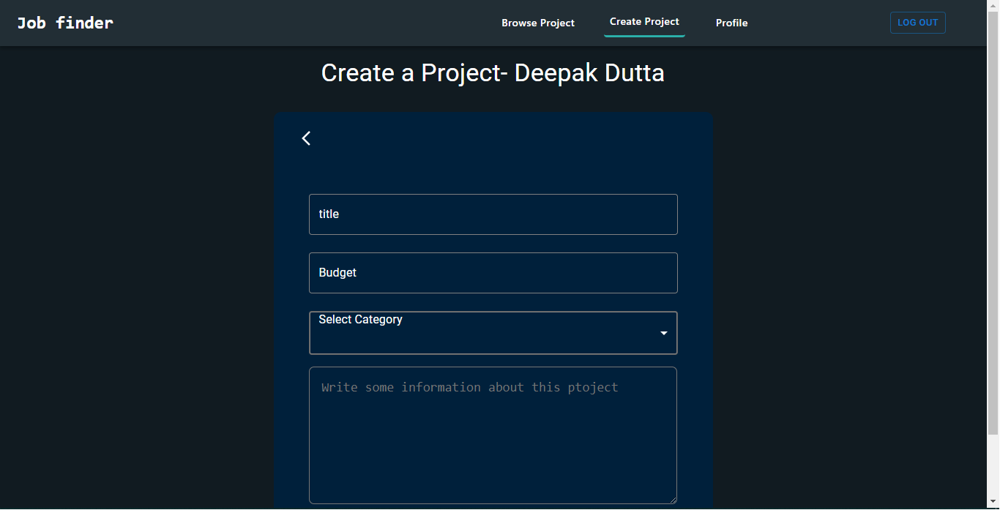
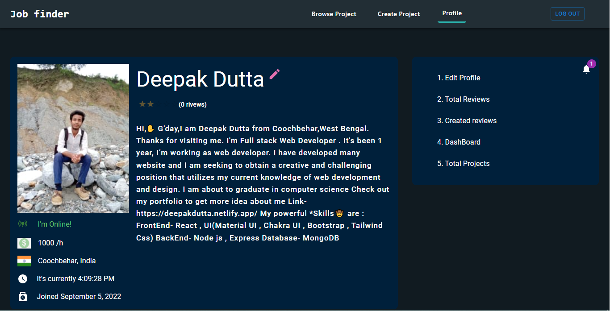
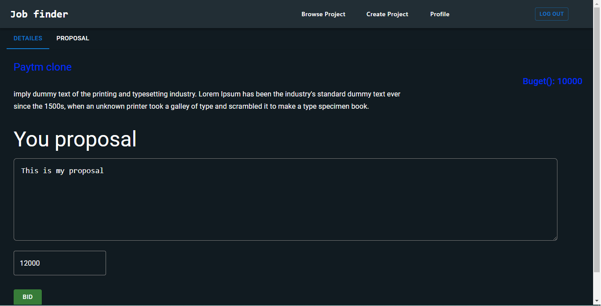
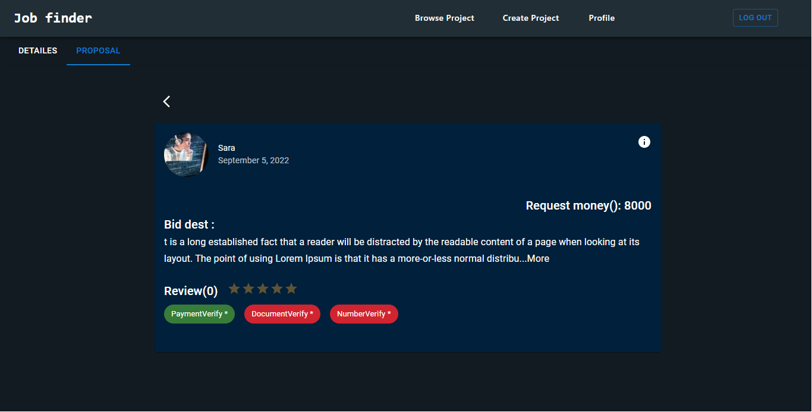

## Job portal website

[Click to check out](https://jobcy.netlify.app/)

## Useges Technology :

```
Reactjs, Nodejs, Mongodb, Meterial ui, Cloudinary, Mailtrap, Rezorpay, Git, Github More.....

**Local storage , Cookie and Secsion Storage**

```

**It is a job portal website like Freelancer. User can create a job, get job, Place proposal , Update there profile-(Photo , Document , update phone number) and more. User can sign up with email.**

## First I create a mind map 👇👇 and start coding

### Added email verification, forgot password and mail sending functionality. Here I am using local storage, cookie, session storage for user verification. All images are stored in Cloudinary and user data stored in MongoDB . The whole website is designed using Material UI .

[Click to check out](https://jobcy.netlify.app/)

## Mind Map👇👇👇



Preview






# This is a open-source project SO , If anyone is interested in contributing to this project, feel free to let me know
